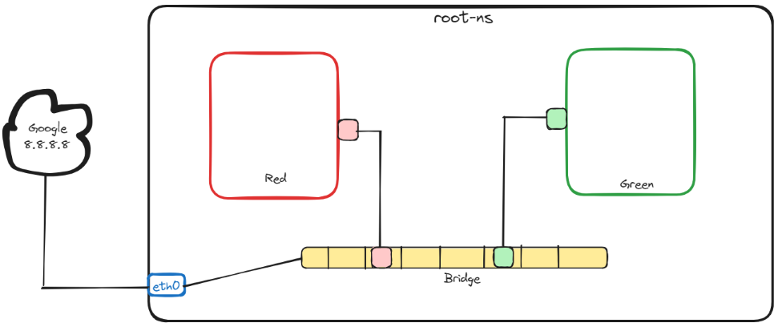

## Module 2 Networking Project
**Project Description:** Make two network namespaces using 'red' and 'green' names, connect them with a bridge, and check connectivity. You have to successfully ping Google's public IP from those network namespaces.
## Work Through

**Step-0:** Install necessary packages or tools in Linux machine using following command

    sudo apt-get update
    sudo apt-get upgrade
    sudo apt-get install iptables iproute2 iputils-ping net-tools -y

**Step-1:** Create two network namespaces (*red and green*)

    sudo ip netns add red
	sudo ip netns add green

**Step-2:** Create a bridge (*br0*) network on the host. `Up` the created bridge and check whether it is created and in UP/UNKNOWN state.

    sudo ip link add br0 type bridge
	sudo ip link set br0 up
	
	#to make sure it's state run this command
	sudo ip link show type bridge

**Step-3:** Now, we need to create two `veth` interfaces for two network namespaces, then attach them to the bridge and namespaces accordingly.

    #creating veths
    sudo ip link add veth-red type veth peer name veth-red-br
	sudo ip link add veth-green type veth peer name veth-green-br
	
	#attaching with namespaces
	sudo ip link set dev veth-red netns red
	sudo ip link set dev veth-green netns green
	
	#attaching with bridge
	sudo ip link set dev veth-red-br master br0
	sudo ip link set dev veth-green-br master br0

**Step-4:**  Change the interface state to `Up` from root namespace

    sudo ip link set veth-red-br up
    sudo ip link set veth-green-br up

**Step-5:**  Inside the `red` and `green` namespaces, change the respective `veth` and loopback interface state to `Up`

    #for red namespace
    sudo ip netns exec red bash
	sudo ip link set veth-red up
	sudo ip link set lo up
	
	#for green namespace
	sudo ip netns exec green bash
	sudo ip link set veth-green up
	sudo ip link set lo up
	
**Step-6:**  Now we will we add IP address to the bridge interface and namespace `veth` interfaces and update route table to establish communication with bridge network and it will also allow communication between two namespaces via bridge

    #for bridge (br0 interface)
    sudo ip addr add 192.168.0.1/24 dev br0
    
	#for red namespace
	sudo ip netns exec red ip addr add 192.168.0.2/24 dev veth-red
	#adding default route
	sudo ip netns exec red ip route add default 192.168.0.1
    
    #for green namespace
    sudo ip netns exec green ip addr add 192.168.0.3/24 dev veth-green
    #adding default route
	sudo ip netns exec green ip route add default 192.168.0.1

**Step-7:**  Now let's check connectivity between two interfaces.

    #ping green interface's ip from red interface
    sudo ip netns exec red ping 192.168.0.3 -c 3
    
    #ping red interface's ip from green interface
    sudo ip netns exec green ping 192.168.0.2 -c 3
   
**Step-7.1:**  In case if still it not works then we may need to add some additional firewall rules.
	
    #from root namespace
    sudo iptables --append FORWARD --in-interface br0 --jump ACCEPT
    sudo iptables --append FORWARD --out-interface br0 --jump ACCEPT

**Step-8:**   So far, we can ping our root ns or primary ethernet interface from custom namespaces. But to communicate to the internet from our namespaces we need to use the NAT (network address translation) by placing an `iptables` rule in the `POSTROUTING` chain of the `nat` table.

    #add SNAT rule at host side (root namespace)
    sudo iptables -t nat -A POSTROUTING -s 192.168.0.0/16  -j MASQUERADE
	
	#to verify use this command
	sudo iptables -t nat -L -n -v

**Step-9:**  Finally, let's check if we can communicate to the internet from `red` and `green` namespaces

    #from red interface
    sudo ip netns exec red ping 8.8.8.8 -c 3
       
    #from green interface
    sudo ip netns exec green ping 8.8.8.8 -c 3

